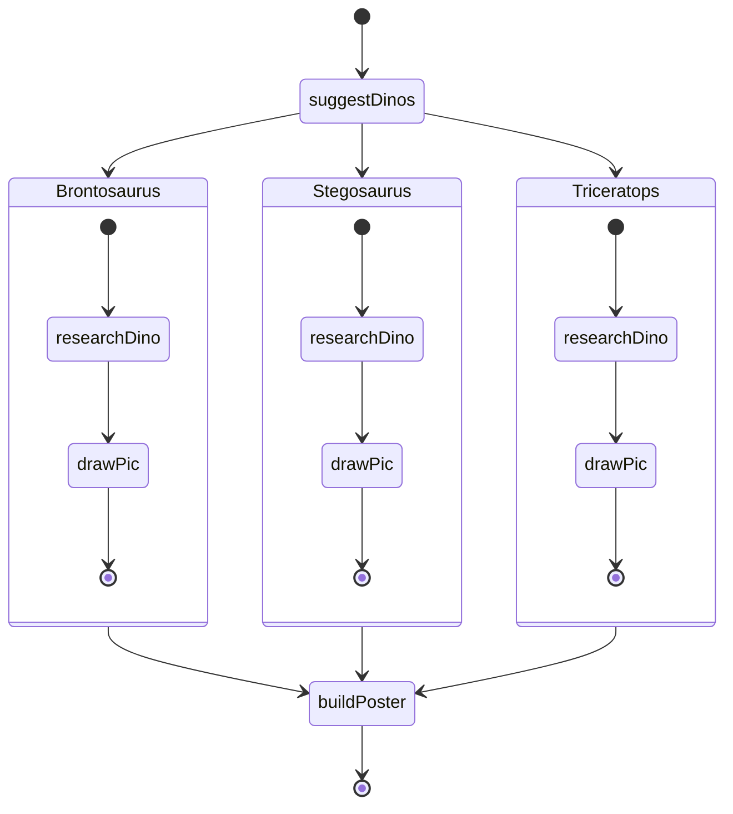

# Agentic Haskell

WARNING: in progress ;)

## Roadmap

- [x] Schema extract and parse
- [x] Type-safe prompting (`inject` & `extract`)
- [x] Fanout combinator and example (`<<.>>`)
- [x] Support for datetime (just works - `UTCTime`)
- [ ] Retry mechanism (when LLM fails to produce compliant schema - give her another chance)
- [ ] Session management (something like `>>> withSession @...` ?) 
- [ ] Re-think RWS (as State is inherently non-concurrent... do we even want it?)
- [ ] Proper task based example
- [ ] Tool use (something like `>>> injectTools [...]` and `>>> usedTool`)

## Strictly Typed LLM Inputs & Outputs

Its a real pain-in-the-ass trying to build "agentic" stuff, when the best tool you have is "pls respond in JSON". Its too weak, JSON doesn't support sum types, and nor does it have a standard schema. 

This research explores using an alternative schema language called Dhall for strictly constraining inputs to and outputs from LLMs. By leveraging Dhall's type system and Haskell's type classes, we can get LLMs to generate responses that parse directly into strongly-typed Haskell values too - meaning we can simply compose smaller bits together to form agents.

### Example

Given this data type:

```haskell
data Joke = Joke
    { genre     :: Text
    , setup     :: Text
    , punchline :: Text
    }
    deriving (Generic, Show, FromDhall, ToDhall)
```

We can convince the LLM to reply to us conforming to this type:

```haskell
ghci> runIO (prompt >>> extract @Joke) "a joke please"
Joke {genre = "Dad joke", setup = "Why did the scarecrow win an award?", punchline = "Because he was outstanding in his field."}
```

How about a list of them?

```haskell
ghci> runIO (prompt >>> extract @[Joke]) "a few jokes please!"
[ Joke {genre = "Dad", setup = "I'm reading a book about anti-gravity.", punchline = "It's impossible to put down."}
, Joke {genre = "One-liner", setup = "I told my wife she was drawing her eyebrows too high.", punchline = "She looked surprised."}
, Joke {genre = "Programming", setup = "Why do programmers prefer dark mode?", punchline = "Because light attracts bugs."}
, Joke {genre = "Animal", setup = "What do you call a fish with no eyes?", punchline = "Fsh."}
, Joke {genre = "Pun", setup = "I would tell you a construction joke...", punchline = "But I'm still working on it."}
]
```

Or just a plain old string?

```haskell
ghci> runIO (prompt >>> extract @Text) "a funny joke please!"
"Why don't scientists trust atoms? Because they make up everything!"
```

Whats the funniest number?

```haskell
ghci> runIO (prompt >>> extract @Int) "a funny joke please!"
42
```

How about something more complex? Lets make a better joke structure with different constructors:

```haskell
data BetterJoke
    = DadJoke { setup :: Text, punchline :: Text }
    | OneLiner { line :: Text }
    | Story { paragraphs :: [Text] }
    | KnockKnock { whosThere :: Text, punchline :: Text }
    deriving (Generic, Show, FromDhall, ToDhall)
```

No problemo for our LLM:

```haskell
ghci> runIO (prompt >>> extract @BetterJoke) "an haskell joke please!"
DadJoke {setup = "Why do Haskell programmers prefer pure functions?", punchline = "Because they don't like side effects."}
```

How about injecting an object, and have it convert to another?

```haskell
ghci> runIO (prompt >>> inject (Joke "knockknock" "knock knock? whos there? boo! boo who?" "don't cry it's only a joke!") >>> extract @BetterJoke) "convert this!"
KnockKnock {whosThere = "boo!", punchline = "don't cry it's only a joke!"}
```

Under the hood - the LLM is generating replies as Dhall objects, and for more complex replies can build fairly sophisticated responses, for example:

```haskell
ghci> runIO (prompt >>> extract @[(BetterJoke, Joke)]) "a few quick dad jokes"
[ ( DadJoke {setup = "I only know 25 letters of the alphabet.", punchline = "I don't know Y."}
  , Joke {genre = "DadJoke", setup = "I only know 25 letters of the alphabet.", punchline = "I don't know Y."}
  )
, ( OneLiner {line = "I'm reading a book about anti-gravity. It's impossible to put down."}
  , Joke {genre = "OneLiner", setup = "Reading a book about anti-gravity.", punchline = "It's impossible to put down."}
  )
, ( KnockKnock {whosThere = "Olive", punchline = "Olive you!"}
  , Joke {genre = "KnockKnock", setup = "Olive", punchline = "Olive you!"}
  )
]
```

Which the LLM represented like this:

```dhall
let AD = < DadJoke : { setup : Text, punchline : Text }
        | OneLiner : { line : Text }
        | Story : { paragraphs : List Text }
        | KnockKnock : { whosThere : Text, punchline : Text } >
let Schema = { _1 : AD, _2 : { genre : Text, setup : Text, punchline : Text } }
let mk = \(variant : AD) -> \(genre : Text) -> \(setup : Text) -> \(punchline : Text) ->
          { _1 = variant, _2 = { genre = genre, setup = setup, punchline = punchline } }
in [ mk (AD.DadJoke { setup = "I only know 25 letters of the alphabet.", punchline = "I don't know Y." })
        "DadJoke" "I only know 25 letters of the alphabet." "I don't know Y."
  , mk (AD.OneLiner { line = "I'm reading a book about anti-gravity. It's impossible to put down." })
        "OneLiner" "Reading a book about anti-gravity." "It's impossible to put down."
  , mk (AD.KnockKnock { whosThere = "Olive", punchline = "Olive you!" })
        "KnockKnock" "Olive" "Olive you!"
  ] : List Schema
```

Wanna play a game of Tic Tac Toe?

```haskell
data Space = Blank | X | O
    deriving (Generic, Show, FromDhall, ToDhall)

data Row = Row Space Space Space
    deriving (Generic, Show, FromDhall, ToDhall)

data Board = Board Row Row Row
    deriving (Generic, Show, FromDhall, ToDhall)
```

Make the first move Mr. LLM!

```haskell
ghci> runIO (prompt >>> extract @Board) "make the first move!"
Board (Row Blank Blank Blank) (Row Blank X Blank) (Row Blank Blank Blank)
```

Which internally the LLM returned like this:

```dhall
let Move = < Empty | X | O >
let Schema = { _1 : { _1 : Move, _2 : Move, _3 : Move }
             , _2 : { _1 : Move, _2 : Move, _3 : Move }
             , _3 : { _1 : Move, _2 : Move, _3 : Move } }
let emptyRow = { _1 = Move.Empty, _2 = Move.Empty, _3 = Move.Empty }
in { _1 = emptyRow
   , _2 = { _1 = Move.Empty, _2 = Move.X, _3 = Move.Empty }
   , _3 = emptyRow } : Schema
```

But how about a full game of Tic Tac Toe? Agentic mode activated!

```haskell
-- Add a few more types to represent the game state:

data GameState = Playing | Ended
    deriving (Generic, Eq, Show, FromDhall, ToDhall)

data Game = Game Board GameState
    deriving (Generic, Show, FromDhall, ToDhall)
```

And write a little while loop in haskell:

```haskell
playTicTacToe :: AgenticRWS m => Agentic m a Game
playTicTacToe = Agentic $ \_input -> do
    iterateUntilM
        -- Repeat until game ends
        (\(Game _ state) -> state == Ended)
        -- Ask the LLM to play the next move
        (\game -> do
            liftIO $ print game
            run (prompt >>> inject game >>> extract @Game) "Play the next move!"
        )
        -- The starting game state
        (Game (Board (Row Blank Blank Blank) (Row Blank Blank Blank) (Row Blank Blank Blank)) Playing)
```

And lets see this poor LLM play against itself!

```haskell
ghci> runIO playTicTacToe "play!"
Game (Board (Row Blank Blank Blank) (Row Blank Blank Blank) (Row Blank Blank Blank)) Playing
Game (Board (Row Blank Blank Blank) (Row Blank X Blank) (Row Blank Blank Blank)) Playing
Game (Board (Row O Blank Blank) (Row Blank X Blank) (Row Blank Blank Blank)) Playing
Game (Board (Row O Blank Blank) (Row Blank X Blank) (Row Blank Blank X)) Playing
Game (Board (Row O Blank O) (Row Blank X Blank) (Row Blank Blank X)) Playing
Game (Board (Row O X O) (Row Blank X Blank) (Row Blank Blank X)) Playing
Game (Board (Row O X O) (Row Blank X Blank) (Row Blank O X)) Playing
Game (Board (Row O X O) (Row X X Blank) (Row Blank O X)) Playing
Game (Board (Row O X O) (Row X X O) (Row Blank O X)) Playing
Game (Board (Row O X O) (Row X X O) (Row X O X)) Ended
```

## Agentic Examples

Lets do something really agentic, researching a project for grade 5:

```haskell
data Dino = Dino
    { name        :: Text
    , description :: Text
    }
    deriving (Generic, Show, FromDhall, ToDhall)

data DinoPic = DinoPic
    { asciiPic :: Text
    }
    deriving (Generic, Show, FromDhall, ToDhall)

dinoProject :: forall a m. (AgenticRWS m, MonadUnliftIO m) => Agentic m a Text
dinoProject =
    let suggestDinos :: Agentic m a [Text]
        suggestDinos = Agentic $ const $ run (prompt >>> extract @[Text]) 
                        "Suggest 3 dinosaur names for my grade 5 project"

        researchDino :: Agentic m Text Dino
        researchDino = Agentic $ \name -> run (prompt >>> inject name >>> extract @Dino) 
                        "Research this dinosaur"

        drawPic :: Agentic m Dino (Dino, DinoPic)
        drawPic = Agentic $ \dino -> do
            pic <- run (prompt >>> inject dino.name >>> extract @DinoPic) 
                    "Draw an ascii picture of this dinosaur, 10 lines high"
            pure (dino, pic)

        buildPoster :: Agentic m [(Dino, DinoPic)] Text
        buildPoster = Agentic $ \dinos -> run (prompt >>> inject dinos >>> extract @Text) 
                        "Create the poster"

    in (suggestDinos <<.>> (researchDino >>> drawPic)) >>> buildPoster
```

Diagrammatically this looks like:



So lets do it!

```haskell
ghci> runIO dinoProject "" >>= putStrLn . unpack
==========================
CRETACEOUS DINOS — POSTER
==========================

1) Tyrannosaurus rex
---------------------

                           __
                          / _)
                 .-^^^-/ / /
              __/       / /
             /  .-""-.  /
            /  / 0  0\/
           |   \  --/ |
           |    '---' /
            \  \____/ /
             `-.__.-'

Tyrannosaurus rex is a large theropod dinosaur from the Late Cretaceous (mainly the Maastrichtian, about 68–66 million years ago), known from western North America. Adults reached len

Distinctive anatomical features include a large, heavy head, short two-fingered forelimbs with powerful musculature attachments, long and muscular hind limbs, and a counterbalancing t

Ecologically, T. rex is interpreted as an apex predator and likely opportunistic feeder (hunting live prey and scavenging). It was first named and described by Henry Fairfield Osborn

------------------------------------------------------------

2) Triceratops
---------------

                ___
              _/   \_
           __/  ^ ^  \__
          /  \  \_/  /  \
         /    \_____/    \
        |  _  /     \  _  |
        | (_) |     | (_) |
         \    |     |    /
          \___\_____/___/
             /_/ \_\

Triceratops is a genus of large herbivorous ceratopsid dinosaur from the latest Cretaceous of western North America (approximately 68–66 million years ago). First named by O. C. Marsh

------------------------------------------------------------

3) Velociraptor
---------------

                    __
                   / _)
            .-^^^-/ /
         __/       /
        /  \  .-""-.
        \   \/  ,  \
         '--.\  `-'/
             /  _/
           _/  /
         _/ _/


Velociraptor is a small, bipedal dromaeosaurid theropod from the Late Cretaceous (approximately 75–71 million years ago), known primarily from the Djadokhta and Barun Goyot formations of Mongolia. Adults measured about 2.0 m in length, stood roughly 0.5 m at the hip, and are estimated to have weighed on the order of 15 kg. Distinctive anatomical features include a long, stiffened tail, an enlarged recurved "sickle" claw on the second toe, and forelimbs adapted for grasping. Direct fossil evidence (quill knobs on the ulna) indicates the presence of feathers. A famous specimen, the "Fighting Dinosaurs," preserves a Velociraptor locked in combat with a Protoceratops. First named in 1924 (Velociraptor mongoliensis), the genus is often misrepresented in popular media as being much larger and more reptilian than the fossil record supports.

------------------------------------------------------------

Credits:
- Artwork: ASCII sketches included
- Text: Summaries of fossil evidence and interpretations

Enjoy your mini Cretaceous poster!
```


Typesafe prompt responses FTW!

The system teaches the LLM Dhall syntax through examples and constrains outputs to match the expected schema, eliminating fragile string parsing and runtime type errors common in JSON-based approaches.

### Other examples...

```haskell
-- This one is cool - returning a tuple
ghci> runIO (prompt >>> extract @[(BetterJoke, Joke)]) "a few quick jokes"

-- Another example using Task
ghci> runIO (prompt >>> extract @[Task]) "3 important tasks when planning a vacation"

-- A guy on r/haskell's example
ghci> runIO (prompt >>> inject (99,27) >>> extract @Int) "calc gcd, pls!"
9

-- Date / Time
ghci> runIO (prompt >>> extract @UTCTime) "when is xmas next year?"
2026-12-25 00:00:00 UTC

ghci> runIO (prompt >>> extract @DayOfWeek) "when is xmas next year?"
Friday

-- Map
ghci> runIO (prompt >>> extract @(Map Text Double)) "approximate rate versus USD of top 5 currencies"
fromList [("AUD",0.66),("CAD",0.74),("EUR",1.08),("GBP",1.27),("JPY",6.7e-3)]

-- Logical stuff
ghci> runIO (prompt >>> extract @Bool) "if its raining outside then we don't go to the beach. It always rains when the postman visits. The postman is here. Can we go to the beach?"

ghci> runIO (prompt >>> extract @Bool) "If it's busy, we need a reservation. If there's a rugby game tonight, the restaurant will be busy. The restaurant is always busy on the Friday & Saturday. The Springboks are playing tonight. Today is Wednesday. Do we need to book?"

ghci> runIO (prompt >>> extract @(Maybe Bool)) "The barber is the 'one who shaves all those, and those only, who do not shave themselves'. The question is, does the barber shave himself?"

```